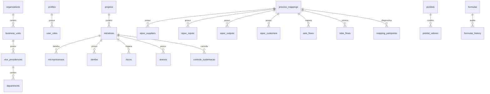

# MODELO DE ENTIDADE-RELACIONAMENTO (ER) — ARQUITETURA ENTERPRISE 3FN

Este documento descreve a modelagem de dados física estruturada para o sistema, normalizada em **3ª Forma Normal (3FN)**, projetada especificamente para o **Google Cloud SQL (PostgreSQL)** e **AlloyDB**.

---

## 1. Justificativa de Normalização (3FN)

Cada tabela foi projetada para obedecer às três formas normais:

1. **1ª Forma Normal (1FN)**: Sem atributos multivalorados ou repetitivos. Cada atributo contém valores atômicos (Ex: tabelas separadas para contatos, membros, anexos e SIPOC).
2. **2ª Forma Normal (2FN)**: Não há dependência parcial. Todos os atributos não-chave dependem inteiramente da chave primária (UUID).
3. **3ª Forma Normal (3FN)**: Não há dependência transitiva. Atributos não-chave dependem apenas e diretamente da chave primária (Ex: dividimos a hierarquia de `organizations` → `business_units` → `vice_presidencies` → `departments` para evitar redundância de dados organizacionais).

---

## 2. Diagrama Entidade-Relacionamento (Texto / Mermaid)

---

## 3. Descrição Técnica dos Domínios e Tabelas (70 Tabelas)

### Domínio 1: Estrutura Organizacional, Perfis & Acesso

1. **organizations**: Guarda as entidades corporativas (Holding/Grupo).
2. **business_units**: Unidades de negócio apartadas geograficamente ou por setor.
3. **vice_presidencies**: Vice-presidências ou Diretorias Executivas superiores.
4. **departments**: Departamentos operacionais com centros de custos específicos.
5. **profiles**: Usuários e colaboradores do sistema corporativo (vinculados ao Firebase Auth).
6. **user_roles**: Perfis de acesso e governança granular (`admin`, `editor_master`, `editor_basico`, `visualizador`).

### Domínio 2: Mapeamento de Processos e Diagnósticos (Lean & BPMN)

7. **macroprocesses**: Cadeias de valor agregadas de alto nível.
8. **subprocesses**: Processos intermediários decompostos da cadeia.
9. **process_mappings**: Mapeamentos canônicos detalhados de processos.
10. **sipoc_suppliers**: Fornecedores das entradas do processo (Mapeamento SIPOC em 3FN).
11. **sipoc_inputs**: Entradas consumidas nas atividades (SIPOC).
12. **sipoc_outputs**: Saídas geradas (SIPOC).
13. **sipoc_customers**: Clientes internos ou externos que consomem as saídas (SIPOC).
14. **asis_flows**: Atividades sequenciais do estado atual (tempo de ciclo e gargalos).
15. **tobe_flows**: Atividades planejadas para o estado futuro automatizado.
16. **mapping_painpoints**: Dores, atrasos, retrabalhos e gargalos operacionais levantados.
17. **mapping_systems**: Softwares utilizados em cada atividade e tempos médios de tela.
18. **process_complexities**: Matriz de classificação de complexidade baseada em regras de negócio e exceções.

### Domínio 3: Portfólio de Iniciativas, Projetos & Equipes

19. **portfolios**: Agrupamentos estratégicos anuais de projetos.
20. **programs**: Programas integrados de transformação sob o mesmo orçamento.
21. **projetos**: Projetos macros do sistema (vínculo de liderança).
22. **iniciativas**: Entidade central de acompanhamento com scores, ROI e prazos.
23. **initiative_members**: Equipe alocada para cada iniciativa específica.
24. **initiative_milestones**: Marcos de entregas críticas com prazos e status.
25. **initiative_sprints**: Fases ágeis com metas definidas.
26. **microprocessos**: Subcamada operacional das iniciativas.
27. **microprocess_steps**: Passos sequenciais de execução interna do microprocesso.
28. **tarefas**: Atividades operacionais de execução com donos específicos e checklists.
29. **task_checklists**: Itens específicos a serem validados dentro de cada tarefa.
30. **task_assignments**: Mapeamento de co-responsabilidade e papéis (RACI) por atividade.

### Domínio 4: Gestão Ágil & Metodologia Ágil

31. **kanban_boards**: Quadros Kanban corporativos de acompanhamento.
32. **kanban_columns**: Colunas dinâmicas estruturadas com limites WIP configuráveis.
33. **kanban_swimlanes**: Raias horizontais para separar fluxos de trabalho.
34. **kanban_cards**: Vinculações de cartões para cada iniciativa.
35. **kanban_card_history**: Histórico de movimentação com tempos de transição (métricas de fluxo).
36. **sprint_schedules**: Planejamento de Sprints de desenvolvimento.
37. **sprint_burndowns**: Dados para plotar gráficos de Burndown reais x planejados.
38. **agile_metrics**: Armazena Lead Time, Cycle Time e Throughput.
39. **retro_feedbacks**: Lições aprendidas estruturadas ao final de cada Sprint.
40. **team_capacities**: Capacidade de alocação de FTE planejado por Sprint.

### Domínio 5: Melhoria Contínua & Kaizen

41. **kaizen_events**: Eventos focados em melhorias rápidas (Kaizen Blitz).
42. **kaizen_ideas**: Banco de ideias propostas para triagem e implantação.
43. **lean_wastes**: Registro de desperdícios identificados (Superprodução, Movimentação, Espera, etc.).
44. **lean_assessments**: Auditorias de prontidão Lean operacionais.
45. **root_causes**: Matriz Causa-Efeito Ishikawa (Diagrama de Espinha de Peixe) estruturada.
46. **root_cause_actions**: Planos de ação direcionados às causas-raiz mapeadas.
47. **root_cause_5whys**: Análise aprofundada dos "5 Porquês".
48. **dmaic_phases**: Fases do ciclo de projetos Six Sigma (DMAIC).
49. **dmaic_gateways**: Entregáveis obrigatórios aprovados para liberação de fases.
50. **value_stream_maps**: Métricas de fluxo de valor do processo mapeado.

### Domínio 6: Métricas, Custos & Acompanhamento de Benefícios (FTE & ROI)

51. **financial_categories**: Categorização de custos corporativos.
52. **budgets**: Planejamento de budgets por projeto.
53. **benefit_forecasts**: Previsão mensalizada de economias e libertação de FTE.
54. **actual_savings**: Captura e homologação real de ganhos financeiros e horas preservadas.
55. **investment_costs**: Custos pontuais de implementação (Hardware, Licenciamento, Consultoria).
56. **resource_allocations**: Alocação financeira de recursos ao longo dos meses.
57. **fte_allocations**: Alocação de porcentagem do tempo do colaborador às iniciativas.
58. **cost_centers**: Centros de custos e diretoria vinculada.
59. **financial_logs**: Trilha financeira auditada de receitas/despesas.
60. **benefit_verifications**: Auditoria formal e homologação dos benefícios declarados.

### Domínio 7: Governança, Riscos, Fórmulas & Segurança

61. **riscos**: Registro corporativo de riscos associados a iniciativas.
62. **risk_mitigations**: Planos de mitigação e ações de controle para riscos.
63. **risk_actions**: Ações pendentes de mitigação executadas pela equipe.
64. **audit_reports**: Relatórios de conformidade e governança.
65. **quality_checks**: Checklists de controle de qualidade das entregas.
66. **non_conformances**: Desvios, retrabalhos de qualidade e ações de melhoria.
67. **formulas**: Repositório central de fórmulas corporativas calculadas em runtime.
68. **formulas_history**: Auditoria e histórico de alterações em expressões matemáticas.
69. **app_configuracoes**: Chave-valor centralizada para parâmetros gerais do app.
70. **user_session_log**: Trilha completa de segurança, acessos e auditoria de usuários.

---

## 4. Estrutura de Auditoria Global e Soft Delete

- Todas as tabelas operacionais possuem os seguintes campos de controle:
  - `created_at` (timestamp, preenchido automaticamente)
  - `updated_at` (timestamp, atualizado em cada modificação)
  - `created_by` (email ou UUID do criador do registro)
  - `updated_by` (email ou UUID do último modificador)
  - `deleted_at` (timestamp nulo por padrão; quando preenchido, indica exclusão lógica)
